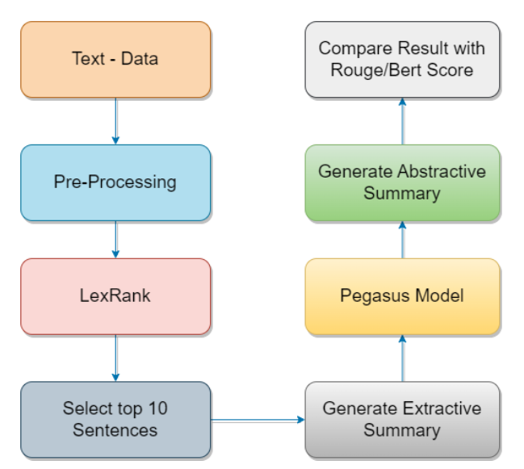

Problem Statement: **Create an abstractive summary using PEGASUS pre-trained transformer model** 

Dataset: The Financial Narrative Summarisation (FNS 2020) dataset has been extracted from UK annual reports published in PDF file format.
For the creation of the financial narrative summarisation dataset we used a number of 3,863 annual reports. We randomly split the dataset into training (c75%), testing and validation (c25%).
On average there are at least 2 gold-standard summaries for each annual report.
Note: Here, For this project we implemented only on validation dataset
FNS2020 Dataset: https://drive.google.com/file/d/1o7iW-cpIXCpQI7mNaYJ4T-2vQOwgRbVw/view

After downloading upzip 
create a fns2020_dataset in root directory and paste content inside 
(eg. fns2020_dataset/validation/annual_reports)

Python Version : 3.8.10

Models: lexRank and Pre-Trained "google/pegasus-large"

Download libraries:

pip install sentencepiece

pip install transformers

pip install nltk  

Work-Flow

run Text_Summarization_Using_LexRank_And_Pegasus.ipynb

Results:

After Generating Abstractive Summaries. 
To Calculate Rouge Score. Use https://github.com/kavgan/ROUGE-2.0 and follow the same instructions that they have mentioned.

After getting result.csv 
Upload result.csv file in Text_Summarization_Using_LexRank_And_Pegasus.ipynb to calculate average rouge score
